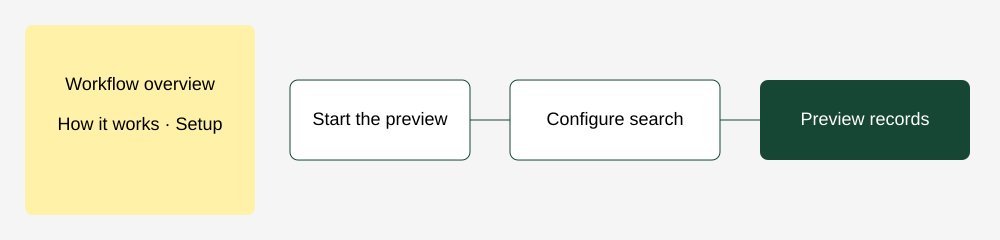

Search records from Ingenium Portal

This workflow is for operations teams who need a bounded, repeatable record search in an organisation's portal. It provides a starting point for audience previews, external reporting and follow-up checks without sending messages or changing records. It uses the selected organisation integration credential, so another organisation requires its own credential and object mapping.

### How it works

Run the workflow manually. The configuration node supplies the object API name, search text and result limit. The Ingenium Portal node searches that object, manages API pagination and returns individual records with their identifiers and values. Review the result count and sample records before extending the workflow into a campaign.

### Setup

Install this development node on a local or self-hosted n8n instance; n8n Cloud installation is unavailable until the package is verified. Create an Ingenium Portal API credential with schema.read, records.read and an allowed object. Select it in the search node. Replace the configuration object's placeholder with a key from that organisation's schema and adjust the search text. Execute once against dummy records. This export contains no credentials or real organisation identifiers.

### Customization

Change the result limit or add typed query filters. Keep the same organisation credential throughout related steps. Use deliberate logical operation keys and inspect receipts when adding writes or SMS.

Development example: runtime import/visual review remains required before marketplace submission.
